# Analysis of SJTU Homepage

## 简介

本文档意在通过使用F12分析SJTU首页，进一步发觉F12的在web开发中的功能，我们的顺序是按照F12中tab从左到右的顺序来进行叙述的，同时，我们将复旦大学主页与上海交通大学主页进行技术上的对比。

## Performance

performance用于从多个方面来对面的性能进行监控，对开发者而言，主要的目的是为了找到性能的瓶颈，在此我们关注的是SJTU homepage在加载完成时的性能检测和分析。

从上到下我们依次进行分析

### 第一部分

代表的是该阶段页面的帧数，我们在加载初始阶段的帧数较低，当页面较为稳定之后，帧数将提高不少，稳定在一个较高的值。

### 第二部分

火焰图的能够看到各个部分CPU堆叠（详见第五部分），主要是分析各个部分使用CPU的情况。

对于几个部分的分类如下：

Loading：对于下载下来的html和页面中图片的地址进行解析（仅仅是解析）

Scripting：对于页面中的JavaScript脚本进行进行运行，例如生成DOM树，查看js脚本是否出错等。

Rendering：顾名思义渲染，将我们的html和js脚本描述的页面转变成画面呈现给用户。

Painting：主要是媒体文件的加载。

Othering： 其他资源的加载。

我们可以看到在页面加载阶段最主要的计算资源的消耗在加载脚本（黄色）和页面的渲染（紫色）上

### 第三部分

不同版块在对于CPU的贡献在我们这个页面中主要是Frames（记录每一帧的页面）和Main中贡献最多。

### 第四部分

针对各个不同版块的整体性能分析，分summary、Bottom-up、Call-Tree和Event log

#### summary

我们可以看到其中script和render的消耗是最大的两个版块，这主要的原因是我们Homepage存在非常多的动画以及首屏的轮播盘，这些动画都需要进行渲染。页面中的所有数据均是在document加载完成后通过ajax访问后端得到数据，再动态加载到页面中的，在加上部分动画是由JS实现的（我们后面会讲部分动画是css实现的）。

#### bottom-up

根据事件耗时长短，反向列出事件列表，有分类可选(通过类型、域、子域、URL分类列出)。

#### call tree

进一步细化，讲时间的消耗进一步分摊到文件和函数上，便于进一步分析瓶颈。

不难发现出去函数调用的相关开销，最大的开销是在我们自己的写的脚本中的第893行

这一行是开发者自己写在/resource/assets/js/main.js的一个初始化函数。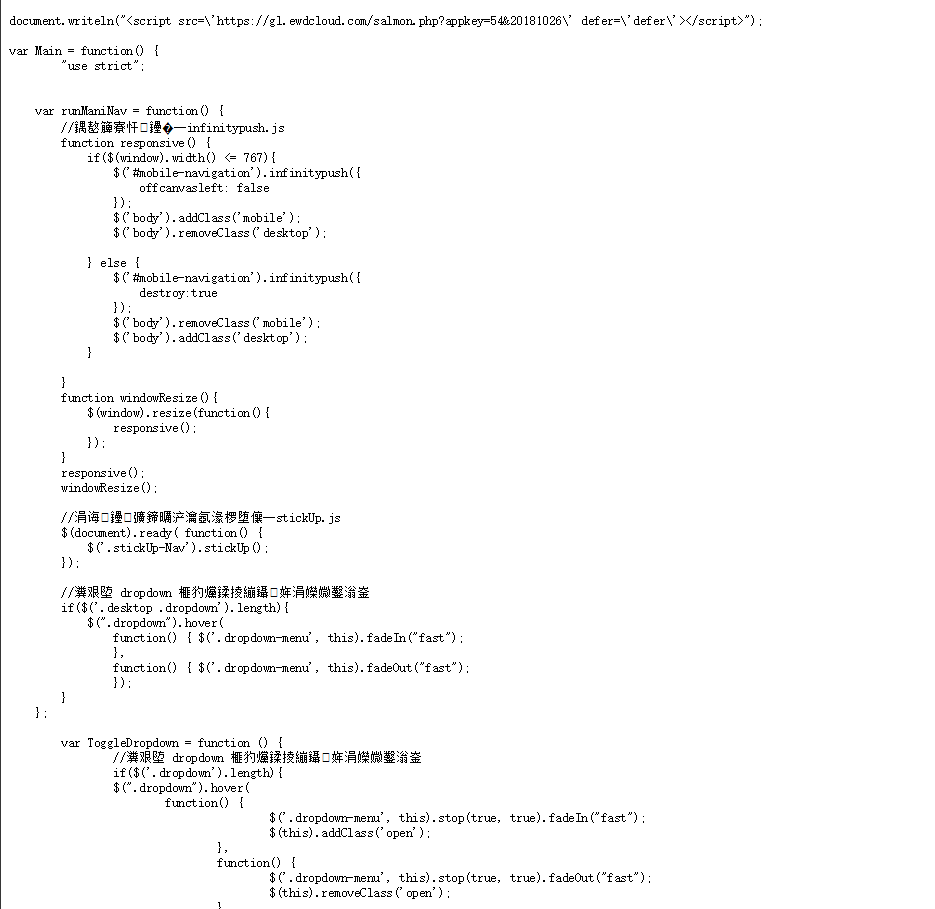

不难看出这个页面里面还有中文注释带来的乱码，以及一些php的痕迹。

#### Event Log

按时间倒叙对页面中发生的事件进行记录

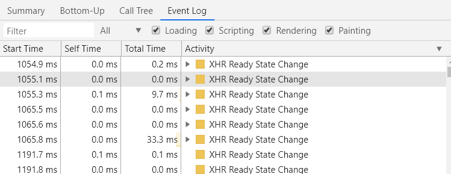

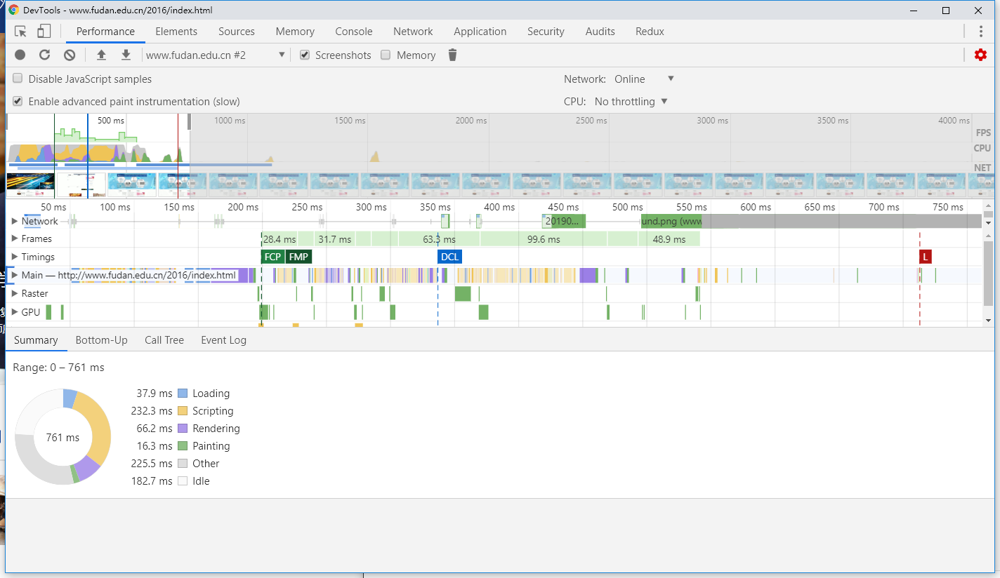

上图为复旦大学首页首屏加载的performance，我们发现总共用时较交大主页小了不少，主要原因是交大的图片数量较多，且图片大小更大（交大最大的图片大小为819KB，复旦为797KB且仅有一图为该量级），另一方面，复旦大学首页的中JS加载的占比比重明显超出交大首页，我们会发现复旦大学首页在动画上不如交大丰富，这是其JS加载量较小且css量较小的原因之一。

## Elements

Elements实质上是在展示生成的DOM主要关切的是样式和绑定的事件，我们这里主要讨论的是动画。

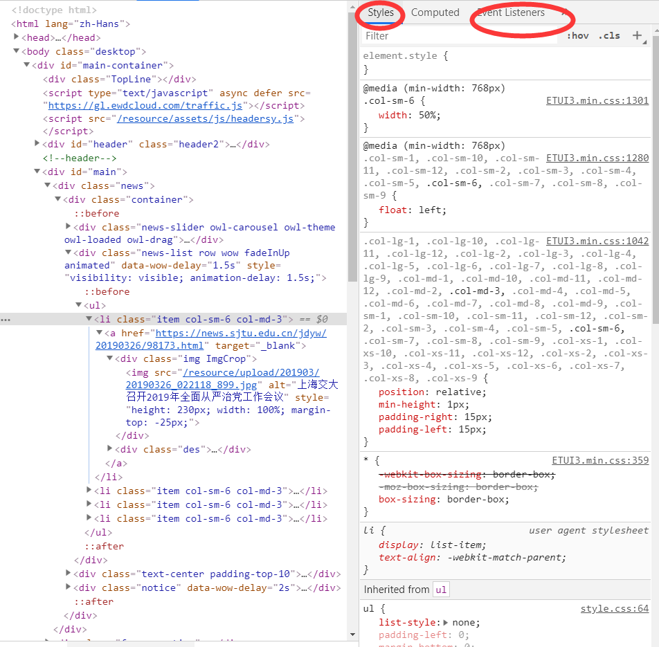

我们在这个地方说名一下一些相关动画的实现，部分是js的部分是css的。

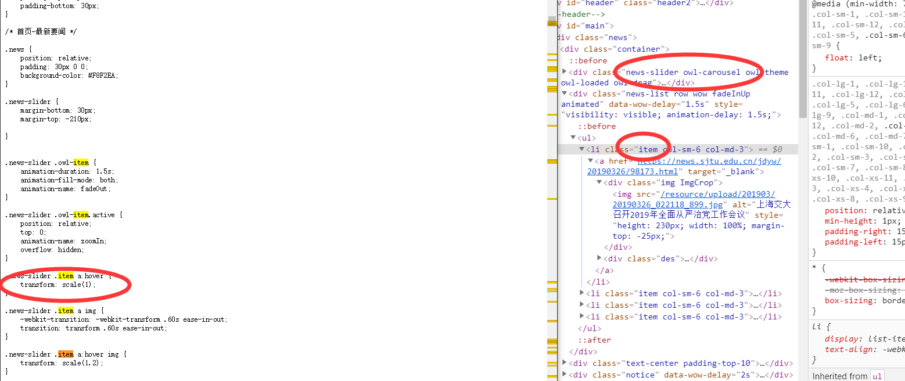

我在event listener中寻找了很久的该项动画，将所有的动作都删除了均无效果，最终寻找几个可能的css(style.css)

发现了该段代码

我们会发现对于轮播盘，将鼠标移动至其上方是通过jquery来实现的。

整体来讲页面的动画设计还是非常完备的。

复旦大学的相关动画非常少，仅存的动态展示都是js实现的。

## Sources

对于页面中使用到的资源进行树形展示，我们可以非常简单明了的发现这个网页的实现并没有使用前端框架，有概率是使用了某种语言的模板引擎。

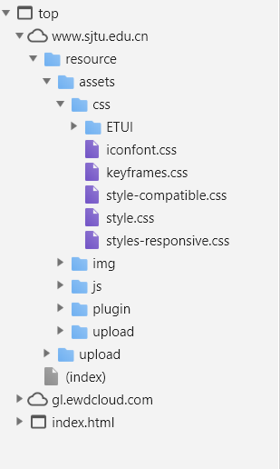

典型的vue框架的Sources如下：

非常明显的能看出SJTU homepage没有使用webpack或其他打包工具对css和js进行压缩打包。

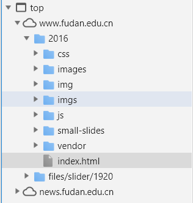

复旦大学首页通交大，可能使用了相应模板引擎。

## Console

我们可以在console中执行相应的js代码，对DOM节点进行相应的操作，此处略过，暂且对性能和页面分析没有太多的共现。

## NetWork

为了分析性能，我们勾选了Disable cache。

我们能看到我们最终拿到了哪些文件和多媒体文件，这里我们主要关注的是XHR和Img，这事整个首页最重要的两个部分。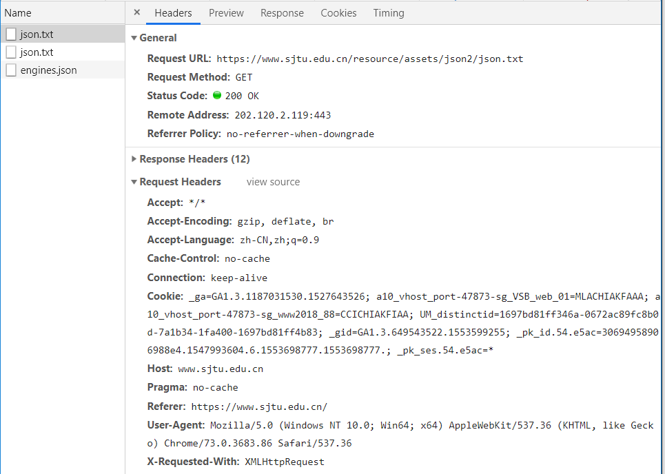

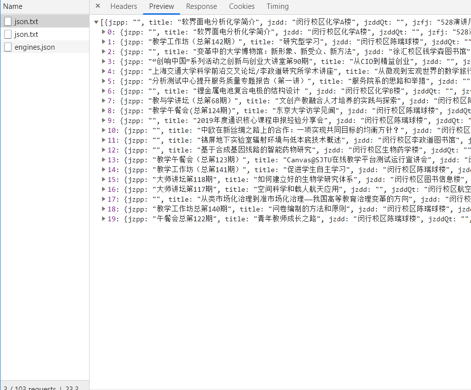

我们发现这个对应页面中的学术日历，这个返回的数据结构中存在着中文拼音缩写，晦涩难懂。

我们发现请求头中并不存在csrf-token，无法防御csrf攻击

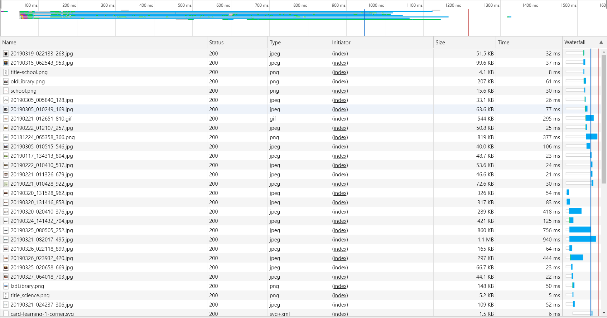

图片整体的加载速度较快，没有明显的卡顿，但没有实现图片的lazy-load，可能主要是归功于服务器带宽高，根本不存在相应的加载问题。

复旦大学使用RSS在网站间分享信息。

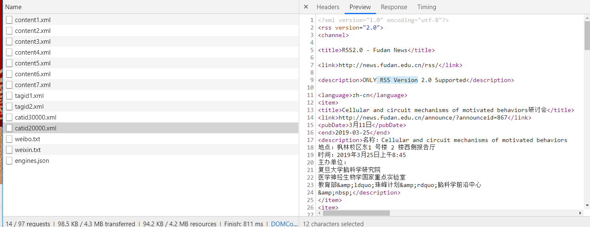

RSS通过将信息存储在xml文件中，用户可以使用RSS阅读器订阅相应的内容，从而避免了主动前往相关网站进行的浏览，其官网使用这项技术的目的可能是用于与原网站进行信息分享，或者是复旦内部存在自行开发的RSS阅读器，与该系统进行匹配。

### Memory

因为是一个展示性页面，因而memory的消耗并不大，只有不到20MB（峰值为22.8MB），复旦大学官网为12.3MB，主要原因是复旦大学首页图片量较少，且JS代码并不多。

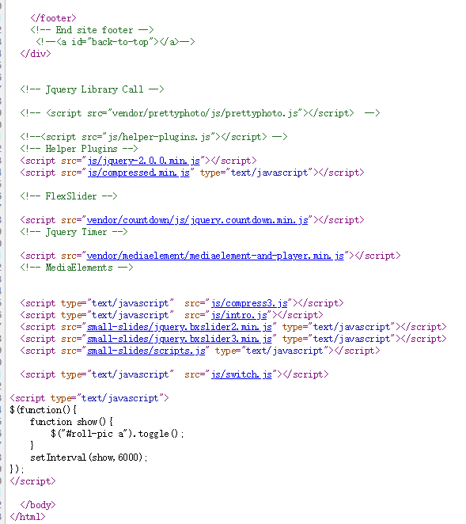

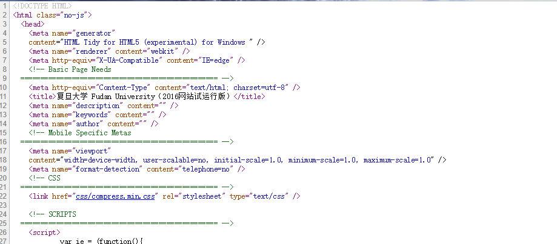

可以明显的看到复旦大学官网首页完全不同于交大，出去轮播盘，基本是一个静态页面，没有使用非常多的JS和CSS。

## Application

展示型页面，Local Storage 和Session Storage中并不存在任何数据，Cookies中只存在少量不明确的数据

## Security

本网站是上海各交大官方网站中率先使用https的网站，这一点希望其他学院向网络信息中心寻求帮助进行反向代理。

如有兴趣可以查看let encrypt的免费证书如何使用。

与之对比，复旦没有使用https，则不可能在微信小程序中打开复旦首页

## mobile

该页面由于是交大官网首页，自适应处理较为完整，且手机适应也做得较好。

而复旦大学对手机是没有自适应的。

## 代码结构的相关问题

我们通过之前的一些介绍，我们可以发现，该页面是浑然一体的，并没有进行组件化的分离的。具体体现在init是一个非常庞大的函数来实现的（前文有讲述）。没有使用前端框架并不是不进行组件化的理由（相应的模板引擎一样能够组件化），这样会使页面再今后重构的时候更加的灵活，也不存在某些奇怪的代码残留（删除某个部分，html删了，js没删）

复旦大学的首页过于简单，没有进行组件化的相关必要，各方面的修改都不会特别复杂。

## 结论

总结一下上海交通大学官网首页分析结果如下：

优点：

1. 图片加载迅速
2. 手机自适应完整
3. 动画优美
4. https

缺点：

1. 未进行组件化分离
2. 为进行各文件的打包压缩
3. 未设置csrf-token
4. 使用中文拼音缩写的变量名，使用中文注释（且乱码）
5. 未实现图片的懒加载

复旦与交大官网对比结果如下：

| 类别                 | 复旦大学官网首页                   | 上海交通大学官网首页         |
| -------------------- | ---------------------------------- | ---------------------------- |
| 响应速度             | 快                                 | 较快                         |
| 页面精美程度与自适应 | 一般                               | 精美                         |
| 代码组织             | 过于简单，未进行打包（也没有必要） | 未进行组件化分离，未进行打包 |
| 安全                 | http                               | https                        |

总的来说，复旦大学官网首页是一个非常轻量级的页面，不存在过多的动画，图片数量相对较少，而交大官网首页为了使页面更加精美，使用了不少的JS和css，相对而言是重量级的，但两个网站由于带宽大，都没有出现非常明显的卡顿。