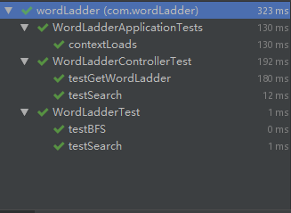

# WordLadder 

> name 谭骁
>
> ID 516110910019

## Display

一定要先开后端，因为前端默认也是8080端口

```bash
# start spring back-end
cd backend
mvn spring-boot:run
# start front-end
npm install 
http-server
```

## Project Architecture 

Briefly introduce the important documents in the project

- app.js

  back end entry file, using Express and WordLadder class to achieve the back end 

- test.js

  test file, test API and page

- wordladder.js

  the implement of class WordLadder

- dictionary.json

  the raw dictionary data

- test.json

  the dictionary data for test

- private.css

  Custom CSS storage here

- wordshow.js

  the important component to show the ladder

- index.html

  The home page, which contains ajax and JS for page dynamic adjustment 

- mochawesome-report

  store the beautified test report

- coverage

  store the beautified coverage report

- backend

  Spring Boot back-end

## Run Test

- Test correctness, run code `npm test`, then you can check the report at **mochawesome-report**
- Test coverage，run code`npm coverage`, then you can check the report at **coverage**

PS : E2E test may wrong because the production environment need special settings(web-driver)

## Feature

1. Express is used as the back end, jQuery library is used in the front end, and the back end is separated
2. It has a validate module at front end
3. Ajax make the page partial refresh

## New backend implemented by Spring Boot

the Spring Boot Backend is in the path of the backend, the front-end just has tiny modify.


## About Junit

WordLadder uses Junit to test the back-end project, which has a two-level test plan:

1. web level

   the purpose of web-level test is to check whether http requests are right and the CORS problem has been solved.

2. wordladder level

   Make sure the application(word ladder kernel) is correct.

the backend test file is in backend/src/test



```bash
# run test
.\mvnw clean test
```